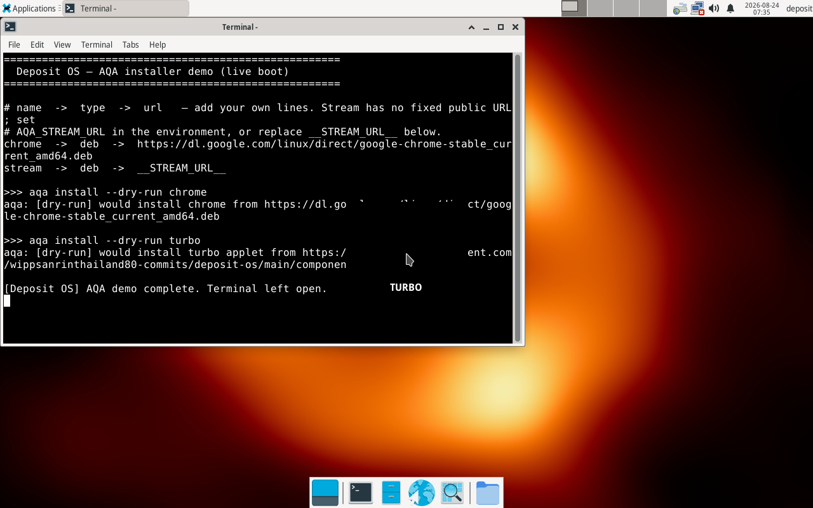
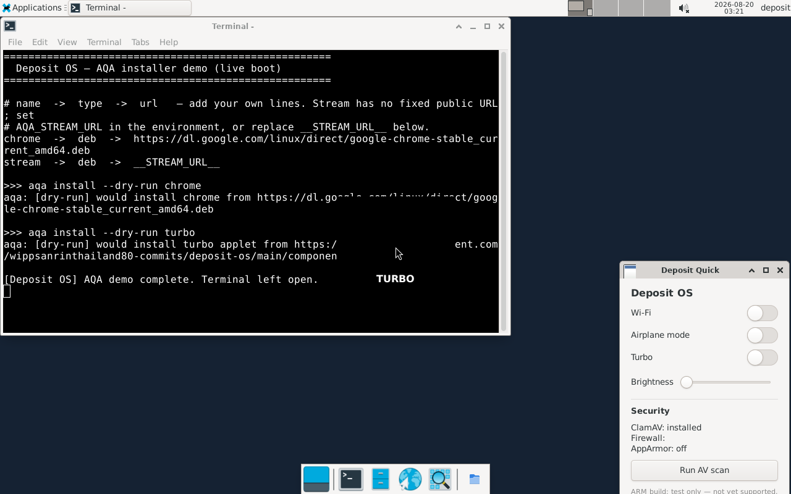
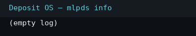
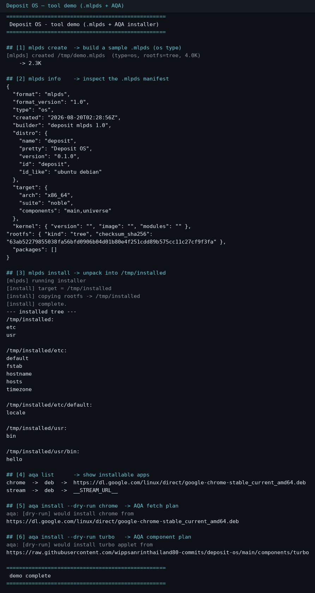

# Deposit OS

**A Linux distribution built from the kernel up** — we compile our own Linux
kernel from upstream source and assemble a minimal, apt-compatible userspace.
Deposit OS runs standard Ubuntu/Debian `.deb` packages (via `apt`/`dpkg`),
runs Windows installers (`.exe`/`.msi`) through Wine, and adds its own
packaging format (`.mlpds`) with the `aqa` installer.

**Beta `0.1.1`** · Andromeda purple-blue theme · x86_64 **and** ARM64

## Highlights

- **Own kernel**: Linux 6.6.58 LTS compiled from kernel.org source —
  `defconfig` + `deposit-broad.cfg` (distro-class driver set) +
  `deposit-80m.cfg` (KVM/VFIO, RDMA, CAN, EROFS, ZRAM, Thunderbolt, tracing).
- **Ubuntu-compatible userspace**: debootstrap of Ubuntu 24.04 (Noble),
  glibc/systemd — ABI-compatible with the Debian/Ubuntu pool. A built-in
  compat layer also runs **jammy (22.04)** and **focal (20.04)** binaries
  (see [Ubuntu compatibility](#ubuntu-compatibility)).
- **`.mlpds` packages + `aqa` installer**: fast unified package management
  with native `.mlpds` support and direct `.deb`/`apt` compatibility.
  `.mlpds` are GPG-signed and verified on install.
- **Windows-friendly**: double-click a Windows installer and it just runs
  (Wine, sandboxed, as your user); flip to a **Windows-style taskbar with a
  Start button** any time; NTFS/exFAT drives read-write out of the box.
- **Both kinds of `.apk`**: Android apps run in a Waydroid container (or
  sideload to a phone via adb), and Alpine-format `.apk` packages install
  into an isolated prefix via apk-tools — auto-detected per file.
- **Bluetooth audio done right**: A2DP profile support so AirPods and other
  BT headsets pair and play at high quality.
- **Turbo mode**: one command flips CPU/GPU into maximum performance with a
  spinning/fade transition FX.
- **Samsung-style quick menu** (`Super+Q`): Wi‑Fi, Airplane, Turbo, LAN,
  Brightness and Volume sliders, Security section, Settings + About tiles.
- **Settings hub**: One UI-inspired settings app — now with a one-tap
  **Windows Mode** row.
- **Andromeda theme**: hand-drawn spiral-galaxy wallpaper (light/dark/
  abstract alternates included), Materia-dark + Papirus-Dark, deep-purple
  translucent panel, branded Plymouth splash.
- **Security hardening**: AppArmor in the kernel, ClamAV, `ufw`, random root
  password replaced at first login, typed confirmation before any disk wipe,
  self-wipe protection for the installer, GPG verification for packages.
- **Thai language** support out of the box (fonts + IBus input).

## Screenshots

| Boot screen | Desktop + quick menu | Turbo transition | `.mlpds` info | Tool demo |
|-------------|---------------------|------------------|---------------|-----------|
|  |  |  |  |  |

(Generated automatically in CI and embedded in each Actions run Summary.)

## Architecture

| Layer        | Choice |
|--------------|--------|
| Kernel       | Linux 6.6.58 from kernel.org source (`build/build-kernel.sh`, fragments in `build/kernel-fragments/`) |
| C library    | glibc (via Ubuntu Noble debootstrap) |
| Init system  | systemd |
| Packaging    | `dpkg`/`apt` + Deposit `.mlpds` (`tools/mlpds`) |
| Installer    | `aqa` (`tools/aqa`) |
| Desktop      | XFCE4 + LightDM · Materia-dark / Papirus-Dark · Andromeda wallpaper |
| Windows apps | Wine + winetricks (`tools/deposit-win`), layout via `tools/deposit-winmode` |
| Live media   | GRUB2 + `live-boot` + SquashFS ISO (x86_64) · GPT/UEFI image (ARM64) |
| Security     | AppArmor (kernel) · ClamAV · ufw · signed `.mlpds` |

## Release channels

Every successful CI run on `main` produces **both** channels from one
pipeline — no branches, no forks:

| Channel (`github release tag`) | Contents | Login behaviour |
|---|---|---|
| **`continuous`** | secure `deposit-os.iso`, `deposit.os.mlpds`, `deposit-arm64.img` | real login screen |
| **`continuous-liveboot`** | convenience media: `deposit-os-live-autologin.iso`, `deposit-arm64-live-autologin.img` | auto-login straight to the desktop |

The live-boot channel bakes autologin into the *media only*. On an installed
system, `deposit-oobe` removes the drop-in once first-boot setup completes,
so the audited login-screen default restores itself. The main channel is
never affected: CI injects autologin only into throwaway copies for
screenshots.

## Quick Start

### Build with GitHub Actions (recommended)

Push to `main` (or open a PR). The CI pipeline:

1. **mlpds tool + scripts + demo** — unit tests and a tool-demo screenshot.
2. **build-kernel** — compiles the kernel (cached between runs).
3. **build-rootfs** — debootstraps the userspace (compat libs + Wine included).
4. **package .mlpds + live boot** — packages the OS as `.mlpds`, boots it under
   QEMU, captures screenshots, builds **both ISOs**, and publishes both
   rolling releases.
5. **build + boot ARM64** *(gated: workflow_dispatch → `arm64=true`)* —
   cross-compiles the ARM64 kernel, builds the ARM64 rootfs and UEFI image,
   then smoke-boots it in QEMU (`virt` machine) with a screenshot.

Artifacts land on the run; releases land on the two tags above.

### Build locally

```bash
bash build/build-kernel.sh            # -> build/output/kernel
bash build/build-rootfs.sh            # -> build/output/rootfs
# Raw disk image (boots via QEMU -kernel):
bash ci/make-disk.sh build/output/rootfs build/output/kernel build/output/deposit-disk.img 4096
# Bootable ISO (BIOS + UEFI):
bash ci/make-iso.sh  build/output/rootfs build/output/kernel build/output/deposit-os.iso
```

Boot the ISO:

```bash
qemu-system-x86_64 -m 2048 -smp 2 -cpu max -cdrom build/output/deposit-os.iso -boot d
```

ARM64 build/cross-build:

```bash
DEPOSIT_ARCH=aarch64 bash build/build-kernel.sh     # cross-compiles
DEPOSIT_ARCH=aarch64 bash build/build-rootfs.sh     # needs qemu-user-static
bash ci/make-arm64-image.sh build/output/rootfs build/output/kernel \
                             build/output/deposit-arm64.img 4096
qemu-system-aarch64 -M virt -cpu max -m 2048 \
  -drive file=build/output/deposit-arm64.img,if=virtio,format=raw \
  -bios /usr/share/qemu-efi-aarch64/QEMU_EFI.fd
```

## Install to a disk

The ISO is a **live + installer** image. To put Deposit OS on real hardware:

1. Write the ISO to a USB stick (replace `sdX` with your stick):
   ```bash
   sudo dd if=build/output/deposit-os.iso of=/dev/sdX bs=4M status=progress; sync
   ```
2. Boot from the USB stick.
3. From the live desktop, double-click **Install Deposit OS** (or run
   `deposit-install` in a terminal). It shows an interactive disk picker,
   refuses to wipe the disk the OS is running from, and requires you to type
   `yes` before touching anything. It GPT-partitions the target (ESP + ext4
   root), copies the system, builds an initramfs, writes `/etc/fstab` and
   installs GRUB for both BIOS and UEFI (existing OSes are detected via
   os-prober).
4. Reboot into the installed disk. On first login you set your own password
   (the build ships a random one that is forced to change).

## Ubuntu compatibility

Deposit OS is Noble-based but ships the older sonames that jammy/focal
binaries link against — alongside the newer ones, with no downgrades:

```bash
deposit-compat              # show pinning + which compat libs are present
deposit-compat check ./app  # ldd a jammy/focal binary -> missing libs?
sudo apt -t jammy install <pkg>   # ad-hoc install from an older suite
```

Implemented as apt pins (`900` noble / `100` jammy,focal) over arch-aware
mirrors; only explicit compat libs are pulled (`libicu70`, `libssl1.1`,
`libicu66`, `libffi7`). Disable with `DEPOSIT_ENABLE_COMPAT=0`.

## Windows-friendly

```bash
deposit-win setup.exe       # run a Windows installer (Wine, as YOUR user)
deposit-win --quiet app.msi # skip the confirmation dialog
deposit-win --no-sandbox g.exe    # this run without the sandbox
deposit-winmode on          # Windows-style taskbar + Start button
deposit-winmode off         # back to the Deposit glass panel
deposit-winmode toggle      # or tap "Windows Mode" in Settings
```

- Double-clicking an `.exe`/`.msi` in the file manager routes through
  `deposit-win`: it prints the file's SHA256 + size, asks once, and never
  runs as root.
- **SHA256 allowlist** (`HASH_POLICY=block` by default): installers whose
  hash is not whitelisted are refused — there is no CLI bypass. Verified a
  file? Append its hash to `~/.config/deposit/win-hash-whitelist`
  (system-wide: `/etc/deposit/win-hash-whitelist`). `HASH_POLICY=warn` in
  `/etc/deposit/win.conf` downgrades refusals to loud warnings.
- **Sandboxed execution**: `SANDBOX=auto` picks firejail (caps dropped,
  seccomp, private `/tmp`) or bubblewrap (explicit binds only: X11, GPU,
  audio, your Wine prefix). Override with `SANDBOX=` or per-run flags.
- `wine`, `winetricks` and the core Windows-metric fonts are preinstalled;
  the Wine prefix lives in `~/.wine` (user-owned).
- Windows mode goes further than the taskbar: GTK widgets switch to
  **Breeze-dark** with Breeze cursors and Carlito (Calibri-metric) fonts,
  so dialogs feel native too.
- NTFS (kernel `ntfs3` + `ntfs-3g`) and exFAT drives mount read-write.
- Lean build? `DEPOSIT_WIN_SUPPORT=0` drops the whole layer.

## Android & Alpine `.apk` packages

`.apk` is two different formats; `deposit-apk` detects which one a file is
and routes it automatically:

```bash
deposit-apk app.apk            # install (auto-detect: Android or Alpine)
deposit-apk --android game.apk # force the Waydroid/adb route
deposit-apk --alpine pkg.apk   # force the apk-tools route
deposit-apk run <binary>       # run an app installed from the Alpine prefix
deposit-apk list               # what's in the Alpine prefix
```

**Android APKs** run via the [Waydroid](https://waydroid.org) container
(kernel Binder enabled in our custom kernel); with no container running,
a connected phone gets the package via `adb install -r`.

**Alpine `.apk`** packages (same format as Alpine/Adélie/postmarketOS) are
installed by the official static `apk-tools` into `~/.deposit/alpine` — an
isolated musl prefix that doesn't touch the Ubuntu base. Packages are
signature-verified against Alpine keys; self-built files need
`deposit-apk --insecure`. Apps run sandboxed under bubblewrap with your
home, GPU, audio and display passed through.

## Bluetooth audio

AirPods, Galaxy Buds and other BT headsets work at full quality:
`pulseaudio-module-bluetooth` provides the A2DP sink profile, so pairing
from **Settings → Bluetooth** or the quick menu connects straight to
high-fidelity audio instead of the handset profile.

## Fedora/RHEL (.rpm) and Arch (.pkg.tar.zst) packages

```bash
deposit-pkg app.rpm              # extract into ~/.deposit/rpm
deposit-pkg prog.pkg.tar.zst     # extract into ~/.deposit/arch
deposit-pkg run rpm <cmd>        # run with the prefix's libs on LD_LIBRARY_PATH
```

Extraction-only by design: dependencies are **not** resolved (install their
packages too — prefixes merge). Binaries usually run thanks to glibc forward
compatibility + our jammy/focal compat libs. Double-click works via mime
handlers.

## คู่มือภาษาไทย

A plain-language Thai manual for everyday users ships in-tree:
**[docs/MANUAL_TH.md](docs/MANUAL_TH.md)** — การติดตั้ง, เมนูด่วน,
ติดตั้งโปรแกรมทุกชนิด (.exe/.apk/.rpm/.deb), Turbo, แก้ปัญหาเบื้องต้น.

## Package management quick reference

```bash
aqa install <URL>          # scan the URL for ALL supported types — .deb, .mlpds,
                           # .apk (Android via Waydroid/adb), .apk (Alpine via
                           # apk-tools) and .exe/.msi (Wine via deposit-win) —
                           # show a numbered menu, install only what you pick.
                           # Direct file links work too.
aqa install <URL> --yes    # scripted mode: install everything found without the
                           # prompt (per-type verification still enforced)

Per-type verification for arbitrary web sources:
  .deb      checksum REQUIRED (#sha256= fragment or 2nd argument;
            --no-verify does NOT bypass it)
  .mlpds    verified by the package's GPG signature
  .apk      Alpine: signature-checked by apk-tools; Android: installs into
            the Waydroid sandbox
  .exe/.msi handed to deposit-win — pass #sha256=<hash> to pre-approve or
            whitelist the hash (HASH_POLICY=block governs)
aqa install chrome         # curated app: installs on its registered sha256, or
aqa install steam          # with --no-verify when no checksum is registered
aqa install turbo          # (trusted source only)
aqa list                   # list installed packages
```

## Specifications (measured on Beta 0.1.1)

| Resource | Minimum | Recommended | Notes |
|----------|---------|-------------|-------|
| Architecture | x86_64 (amd64) | x86_64; ARM64 supported (UEFI — QEMU `virt`, Pi 4/5-class; [issue #1](https://github.com/wippsanrinthailand80-commits/deposit-os/issues/1)) |
| RAM | 1 GB (desktop, light use) | 2 GB desktop · 4 GB with Wine/Waydroid | Idle-desktop footprint measured automatically in CI (`deposit-idle-metrics` artifact); 1 GB works for XFCE+browser-tab-light, not for heavy apps |
| Storage | 8 GB | 16 GB+ | Installed system ≈ **0.9 GB** (measured: extracted rootfs 908 MB incl. kernel modules); ISO ≈ **434 MB**; rest is your apps, updates and package caches |
| Graphics | VGA / any (boots headless too) | GPU with open drivers for Turbo + compositing | Compositor ON by default since Beta 0.1.1 |
| Network | optional | Ethernet or Wi‑Fi | |

Download sizes you will actually see: `deposit-os.iso` ≈ 434 MB ·
`deposit-arm64.img` ≈ 840–870 MB · `.mlpds` OS package ≈ 290 MB compressed.

## Status & roadmap

Deposit OS is functional and reproducibly built in CI, but is **beta** — see
[ROADMAP.md](ROADMAP.md) for the honest gap list (real-hardware kernel
validation, ARM64 laptops, Updater-v2, A/B atomic updates, UI polish pass).
Highlights of what is *not* done yet:

- **Real-hardware testing** — the broad kernel is QEMU-validated, not
  field-tested across machines. Hardware testers welcome (`docs/` template).
- **ARM64** — build + UEFI smoke-boot proven; real-laptop bring-up pending.
- **A/B atomic updates** — designed (btrfs-snapshot route), not implemented.
- **Updater UX** — apt+aqa today; unified one-button v2 is the next slice.

## Project layout

```
build/                 kernel + rootfs build scripts and config
  kernel-fragments/    deposit-broad.cfg, deposit-arm64.cfg, deposit-80m.cfg
tools/                 aqa, mlpds, deposit-turbo, deposit-quickmenu,
                       deposit-settings, deposit-files, deposit-compat,
                       deposit-win, deposit-winmode, deposit-apk, deposit-pkg, deposit-av,
                       deposit-turbo-fx, deposit-security, deposit-store,
                       deposit-updater, deposit-oobe, deposit-install
ci/                    make-disk.sh, make-iso.sh, make-arm64-image.sh,
                       live-boot.sh, inject-autologin.sh, publish-release.sh,
                       demo + render helpers
assets/                logo, gear, wallpapers (andromeda/light/dark/abstract)
docs/assets/           screenshots used in this README
```

## License

GPL-3.0 — see [LICENSE](LICENSE). The OS bundles many upstream components
(Linux kernel, glibc, XFCE, Wine, …) each under their own licenses.

## Contributing

See [CONTRIBUTING.md](CONTRIBUTING.md).
